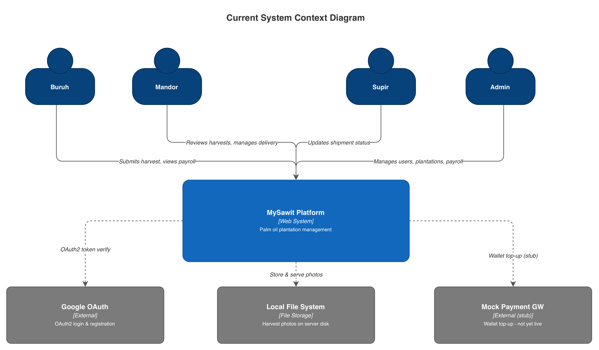
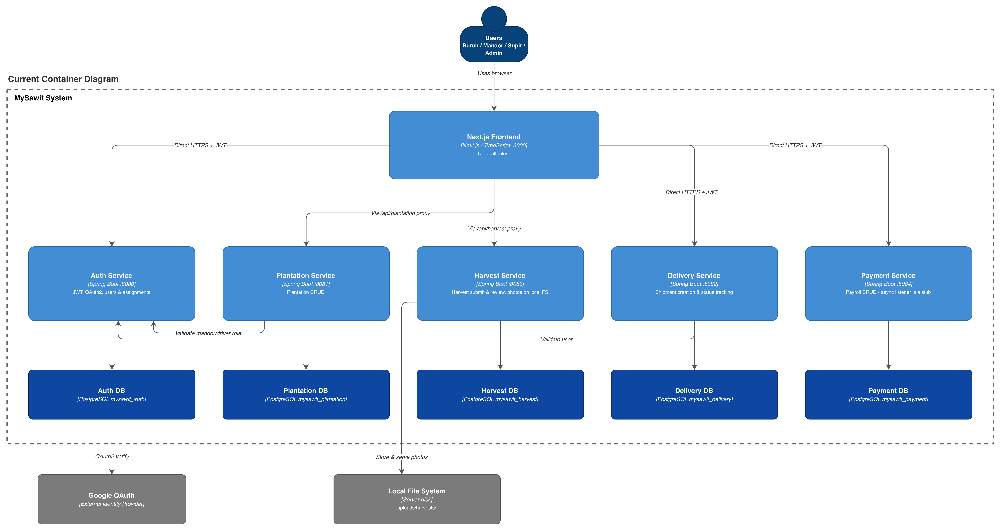
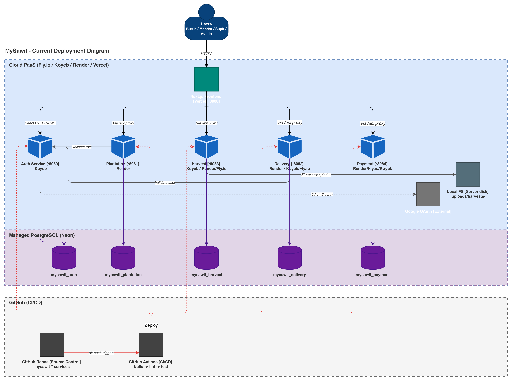
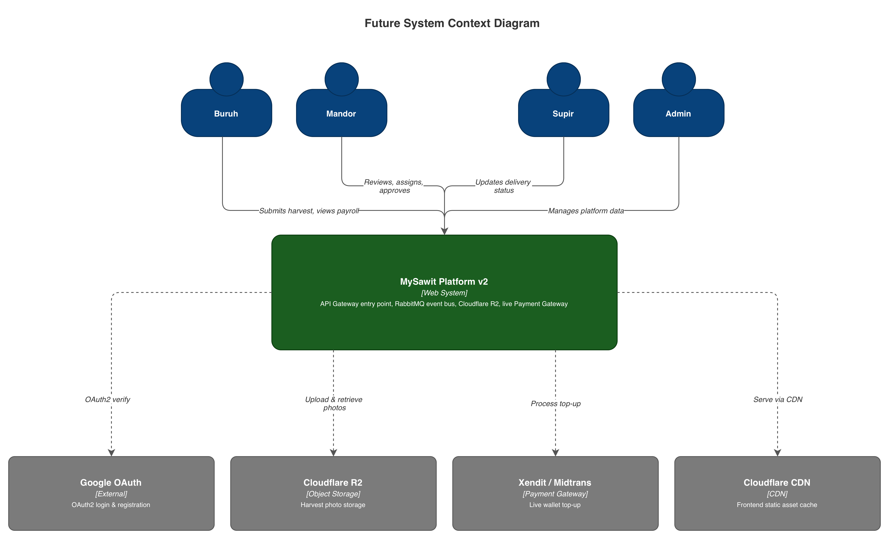
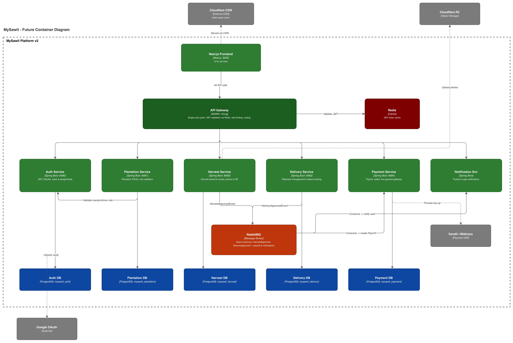
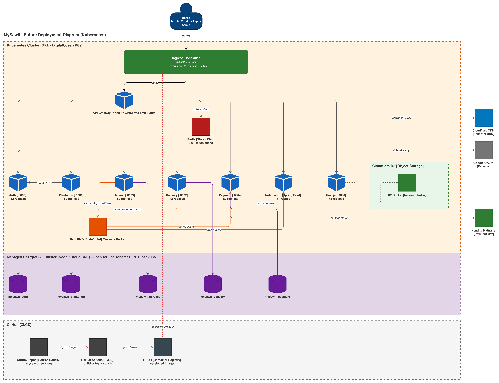

# MySawit — Distributed Plantation Management Platform

MySawit is a distributed web platform for managing large-scale palm oil plantation operations using a modular microservice architecture.

This repository contains the `mysawit-auth` service (authentication and user management) as part of the larger MySawit system.

## Table of Contents
- [System Overview](#system-overview)
- [Architecture](#architecture)
- [Tech Stack](#tech-stack)
- [Core Modules](#core-modules)
- [Project Structure](#project-structure)
- [Service Architecture](#service-architecture)
- [Clean Code Principles](#clean-code-principles)
- [DevOps & Code Quality](#devops--code-quality)
- [Running the Project](#running-the-project)
- [Development Workflow](#development-workflow)
- [Future Improvements](#future-improvements)

---

## System Overview

MySawit coordinates workflows between plantation workers (buruh), supervisors (mandor), drivers (supir truk), and administrators. It tracks assignments, harvest reporting, logistics, and payroll while enforcing validation and traceability.

## Architecture

The platform follows a microservice architecture with a Database-per-Service pattern. Services communicate via REST APIs and asynchronous events where appropriate.

Key characteristics:
- Domain-driven service separation
- Independent deployment per service
- Loose coupling and clear responsibility boundaries
- Event-driven communication for asynchronous processes

Deployment and CI/CD:
- Fly.io for deployments
- GitHub Actions for CI/CD

## Tech Stack

- Backend: Spring Boot (Java)
- Authentication: JWT
- Database: PostgreSQL
- Object storage: Cloudflare R2
- Frontend (system-wide): Next.js
- CI/CD: GitHub Actions
- Testing: JUnit
- Coverage: JaCoCo
- Linting: Checkstyle (backend), ESLint (frontend)

## Core Modules

This service is part of a larger set of domain services such as:
- `mysawit-auth`
- `mysawit-plantation`
- `mysawit-harvest`
- `mysawit-delivery`
- `mysawit-payment`
- `mysawit-notification`

Within each service, common modules include:
- Authentication & User Management
- Plantation Management
- Harvest Management
- Delivery Management
- Payment Management
- Notification System

Each module owns its domain logic and database and exposes APIs for interaction.

## Project Structure

Typical layout for a service:

```
service-name/
├── Dockerfile
├── docker-compose.yml
├── build.gradle.kts
├── settings.gradle.kts
├── config/
│   └── checkstyle/
├── src/
│   ├── main/
│   │   ├── java/
│   │   │   └── (package)/
│   │   │       ├── controller/
│   │   │       ├── dto/
│   │   │       ├── entity/
│   │   │       ├── repository/
│   │   │       ├── service/
│   │   │       ├── security/
│   │   │       └── config/
│   │   └── resources/
│   │       ├── application.yml
│   │       └── static/
│   └── test/
└── gradle/
```

## Service Architecture

Layered responsibilities:

- Controller → handles HTTP endpoints and validation
- DTO → request/response objects
- Service → business logic and orchestration
- Repository → persistence (Spring Data JPA)
- Entity → JPA-mapped domain objects

## Clean Code Principles

The codebase follows SOLID principles, layered architecture, and DTO isolation to keep the API boundary clear and maintainable.

## DevOps & Code Quality

CI pipeline steps (GitHub Actions): build, lint, test, coverage.

Tools: Checkstyle, ESLint, JUnit, JaCoCo, CodeRabbit (code review automation).

## Running the Project

### Prerequisites

- Java 17+
- Docker (optional)
- Gradle (wrapper provided)
- PostgreSQL (or a running DB compatible with the configuration)

### Build

```bash
./gradlew build
```

### Run locally

```bash
./gradlew bootRun
```

### Run with Docker Compose

```bash
docker-compose up --build
```

## Development Workflow

Typical flow:
1. Create feature branch
2. Implement feature
3. Run tests and linting
4. Create a pull request
5. CI validation and code review
6. Merge and deploy

## Current Architecture Diagrams

### Current System Context Diagram



---

### Current Container Diagram

The current container architecture illustrates the microservice separation between authentication, plantation, harvest, delivery, payment, and notification services. Each service is independently deployable and communicates primarily through REST APIs.



---

### Current Deployment Diagram

Services are currently distributed across different hosting providers and infrastructure environments.



## Future Architecture

### Future System Context Diagram



---

### Future Container Diagram

The future container architecture introduces several new infrastructure components including an API Gateway, RabbitMQ for asynchronous communication, Redis for caching, and Cloudflare R2 for object storage. These additions improve consistency, scalability, and resilience across services.



---

### Future Deployment Diagram

The future deployment architecture consolidates services into a Kubernetes-based environment to simplify orchestration, scaling, networking, and infrastructure management.



## Risk Mitigation - Deliverables G.3

### Mengapa teknik Risk Storming diterapkan?

Kami menerapkan teknik Risk Storming untuk mengidentifikasi, memprioritaskan, dan mengurangi risiko pada sistem MySawit yang menggunakan arsitektur microservice. Karena sistem terdiri dari banyak service yang saling terhubung, komunikasi antar service, deployment terpisah, dan penggunaan asynchronous event menjadi bagian penting yang perlu diperhatikan sejak awal pengembangan.

Dengan Risk Storming, kami dapat mendiskusikan kemungkinan masalah yang dapat muncul ketika sistem berkembang dan digunakan dalam skala yang lebih besar. Teknik ini membantu kami memahami titik lemah pada arsitektur saat ini, menentukan risiko yang paling berbahaya, serta merancang solusi dan perubahan arsitektur yang lebih aman dan scalable untuk pengembangan ke depannya.

---

### Hasil Identifikasi Risiko

Kami mendapati bahwa komunikasi frontend ke backend yang tidak konsisten menjadi risiko yang cukup tinggi. Beberapa service diakses langsung menggunakan URL masing-masing, sementara service lain menggunakan proxy melalui Next.js API routes. Kondisi ini menyebabkan tidak adanya satu titik terpusat untuk melakukan autentikasi, logging, dan rate limiting sehingga pengelolaan keamanan menjadi lebih sulit.

Kami juga mendapati bahwa proses asynchronous payroll pada sistem saat ini belum berjalan dengan benar. `HarvestApprovedEvent` masih menggunakan `ApplicationEventPublisher` milik Spring yang hanya bekerja di dalam satu aplikasi dan tidak dapat digunakan untuk komunikasi antar microservice. Selain itu, subscriber pada payment service masih kosong sehingga approval harvest belum benar-benar menghasilkan data payroll.

Kami mendapati bahwa penyimpanan foto harvest pada local filesystem juga menjadi risiko yang cukup tinggi. File dapat hilang ketika container restart atau redeploy, dan pendekatan ini menyulitkan horizontal scaling karena setiap instance service tidak berbagi file storage yang sama.

Selain itu, deployment service yang tersebar di berbagai platform seperti Fly.io, Render, Koyeb, dan Vercel berpotensi menimbulkan masalah pada pengelolaan environment, networking, secret management, dan deployment coordination ketika sistem semakin besar.

---

### Strategi Mitigasi Risiko

#### Komunikasi Frontend dan Backend yang Tidak Konsisten

Mitigasi dilakukan dengan menambahkan API Gateway seperti NGINX atau Kong sebagai single entry point untuk seluruh request dari frontend. Dengan pendekatan ini, autentikasi JWT, request logging, dan rate limiting dapat dilakukan secara terpusat sehingga komunikasi antar service menjadi lebih konsisten dan aman.

#### Asynchronous Payroll Flow Tidak Berjalan

Mitigasi dilakukan dengan mengganti event internal Spring menjadi message broker RabbitMQ. Harvest Service akan mengirim event ke RabbitMQ dan service lain seperti Payment Service maupun Notification Service dapat mengonsumsi event tersebut secara asynchronous. Pendekatan ini membuat komunikasi antar service lebih reliable dan loosely coupled.

#### Risiko Kehilangan File Harvest

Mitigasi dilakukan dengan memindahkan penyimpanan file dari local filesystem ke Cloudflare R2 yang bersifat object storage dan kompatibel dengan S3. Dengan demikian, file tetap tersimpan meskipun terjadi redeploy atau scaling pada service.

#### Deployment dan Infrastruktur yang Terpisah-Pisah

Mitigasi dilakukan dengan memindahkan seluruh service ke Kubernetes cluster seperti GKE atau DigitalOcean Kubernetes. Pendekatan ini memberikan deployment environment yang lebih terpusat, mempermudah scaling, networking, serta pengelolaan secret dan observability antar service.

#### Deployment Process yang Sulit Dikelola

Mitigasi dilakukan dengan menambahkan pipeline CI/CD menggunakan GitHub Actions dan ArgoCD. Setiap perubahan kode akan otomatis dibuild, diuji, dan dideploy sehingga proses deployment menjadi lebih konsisten, reproducible, dan mudah dimonitor.